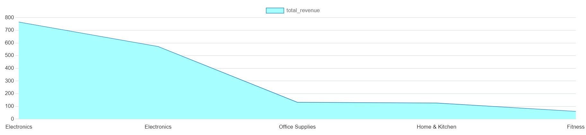
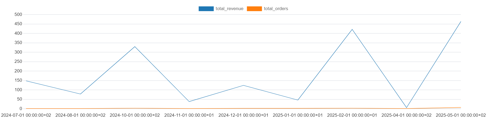
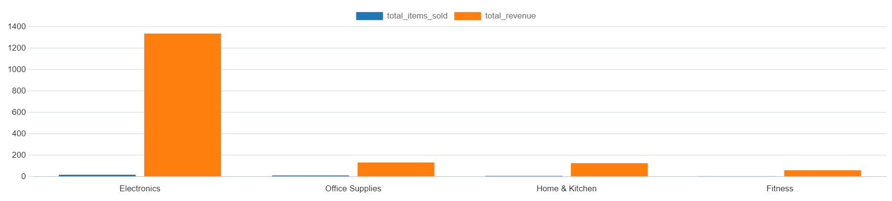

# E-Commerce Sales Insights with PostgreSQL

A reproducible e-commerce analytics project covering relational data modeling, database setup, KPI analysis and business recommendations.

> The project uses a small simulated dataset to demonstrate the workflow. Its findings are illustrative rather than representative of a real business.

## Business questions

- Which products and categories generate the most revenue?
- Who are the highest-value customers?
- What proportion of customers purchase repeatedly?
- How do revenue and order volume change over time?

## Data model

| Table | Purpose |
|---|---|
| `customers` | Customer details, signup date and acquisition source |
| `products` | Product name, category and price |
| `orders` | Order date, total and customer relationship |
| `order_items` | Product-level quantities within each order |

The schema is defined in [`database_schema.sql`](./database_schema.sql).

## Analysis

Queries in [`analysis_queries.sql`](./analysis_queries.sql) calculate:

- Revenue by product and category
- Monthly revenue and order trends
- Average order value
- Top customers by spend
- Customer order frequency and repeat purchasing

## Findings

- Electronics generated the most revenue and sales volume in the sample.
- Most customers placed only one order, indicating a retention opportunity.
- Repeat customers contributed disproportionately to revenue.

More detailed interpretation is available in [`business_insights.md`](./business_insights.md).

## Visualizations

### Customer order frequency

### Highest-revenue products

### Monthly sales trends

### Orders and revenue by category

## Reproduce the project

1. Clone the repository.
2. Create a PostgreSQL database.
3. Run `postgresql_ecommerce_full_setup.sql` in pgAdmin or `psql`.
4. Run the queries in `analysis_queries.sql`.
5. Review the charts and `business_insights.md`.

## Tools

PostgreSQL 17, SQL, pgAdmin, Python, Git and GitHub

## Author

[Atif Elmasry](https://github.com/AtifElmasry) · [LinkedIn](https://www.linkedin.com/in/tioatifelmasry/)
