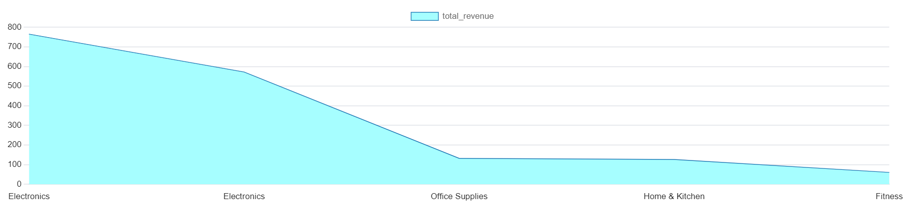
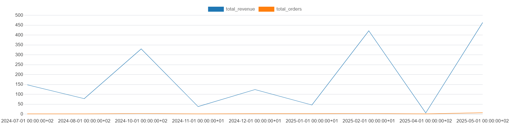
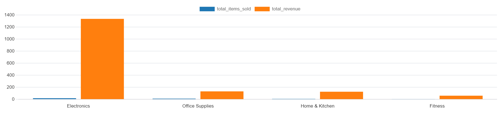

# 🛒 E-Commerce Sales Insights with PostgreSQL

This project simulates a real-world e-commerce analytics workflow using **PostgreSQL**. It covers everything from relational schema creation and sample data population to advanced SQL analysis and visual business insights.

---

## 📌 Project Highlights

- 🗃️ Relational schema: customers, products, orders, order_items
- 🛠️ SQL queries for KPIs like total revenue, top customers, repeat rate
- 📊 Visualizations generated using pgAdmin and Python
- 🧠 Business insights included in markdown format
- 🚀 GitHub-friendly structure with reproducible scripts

---

## 🧱 Database Structure

- `customers`: customer info, signup date, referral source
- `products`: name, category, price
- `orders`: order total, date, linked to customer
- `order_items`: detailed product quantities per order

📄 Schema file: [`database_schema.sql`](./database_schema.sql)

---

## 🧪 Sample Data

Fake but realistic data using SQL and Python:
- 10 customers
- 5 products across 4 categories
- Dozens of orders and order items

📄 Data scripts:
- [`sample_data.sql`](./sample_data.sql)
- [`sample_customers.sql`](./sample_customers.sql)

---

## 📊 Analysis Queries

Stored in [`analysis_queries.sql`](./analysis_queries.sql), including:

- Top 5 customers by spending
- Revenue by product and category
- Monthly sales trends
- Average order size
- Repeat customers

---

## 📈 Visualizations

### 🔁 Customer Order Frequency  
Shows how many customers placed 1, 2, or 3 orders.

---

### 💸 Highest Revenue-Generating Products  
Displays the top-selling products based on total revenue.

---

### 📆 Monthly Sales Trends  
Tracks monthly revenue and order volume.

---

### 📊 Total Orders and Revenue by Category  
Comparison of units sold vs revenue by category.

---

## 📑 Business Insights

Real-world business insights and recommendations are included in:  
📄 [`business_insights.md`](./business_insights.md)

Sample takeaways:
- Electronics dominate revenue and volume
- Most customers order only once — churn risk
- Repeat buyers contribute disproportionately to revenue

---

## 🚀 How to Run This Project

1. Clone the repo
2. Import [`postgresql_ecommerce_full_setup.sql`](./postgresql_ecommerce_full_setup.sql) into pgAdmin or run via psql
3. Explore queries and visualizations via pgAdmin or Python

---

## ⚙️ Tools Used

- PostgreSQL 17
- pgAdmin 4
- SQL
- Python (optional for charts)
- Git + GitHub

---

## 👋 Author

**Atif Elmasry**  
📍 Berlin-based aspiring Data Analyst  
🔗 [LinkedIn](https://www.linkedin.com/in/tioatifelmasry) | [GitHub](https://github.com/AtifElmasry)

---
